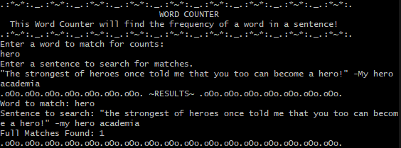
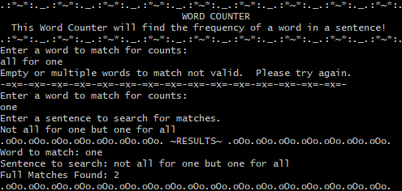
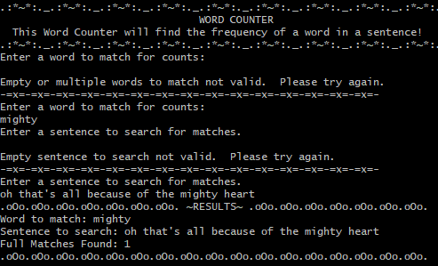
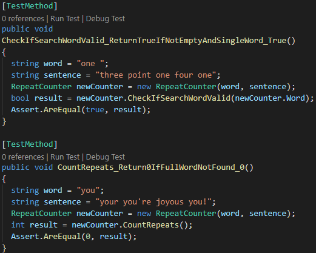
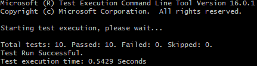

# _[C# Word Counter](https://github.com/TSiu88/WordCounter-Csharp)_

#### _Week 9 Independent Friday Assignment for [Epicodus](https://www.epicodus.com/), 03.06.2020_

#### By _**Tiffany Siu**_
---
## Table of Contents
1. [Description](#description)
2. [Setup/Installation Requirements](#setup/installation-requirements)
    - [Requirements to Run](#requirements-to-run)
    - [Instructions](#instructions)
    - [Other Technologies Used](#other-technologies-used)
3. [Notable Features](#notable-features)
4. [Specifications](#specifications)
5. [Screenshots](#screenshots)
6. [Test Case Example](#test-case-example)
7. [Known Bugs](#known-bugs)
8. [Support and Contact Details](#support-and-contact-details)
9. [License](#license)
---
## Description

This application is the Week 9 Friday independent assignment for Epicodus' full time Intro to Programming and C#/React course.  This is a program made to show creating coded tests in C# and following a Red, Green, Refactor workflow to create a clear, tested product with DRY code.

This program is a console application that allows a user to enter a word and a sentence.  From these two inputs the program would count the amount of times a word appeared in the sentence if it is given inputs that are both valid.  A word is considered valid if it is not empty or only whitespace and only consists of a single word.  A sentence is considered valid if it is not empty or only whitespace.  The program only checks for case insensitive, full word matches so it does not count a match if the word is connected to other special characters like punctuation or is part of another word.  For example if the word was "hero", the words "hero!", "heroes", or "switcheroo" are not considered matches.

## Setup/Installation Requirements

### Requirements to Run
* _.NET Core_
* _Command Line Interface_

### Instructions

*This page may be viewed by:*

1. Download and install .NET Core from the [official website](https://dotnet.microsoft.com/download/dotnet-core/)
2. Clone the [repository](https://github.com/TSiu88/WordCounter-Csharp.git) from my [GitHub page](https://github.com/TSiu88)
3. Use a command line interface to move to the repository's directory with `cd project-directory`
4. Run `dotnet run` to start up the program in the command line interface 

### Other Technologies Used
* _C#_
* _MSTest_
* _Markdown_

## Notable Features
For this project I followed the Red, Green, Refactor workflow completely for the entire program.  I also used several visual and formatting items in the README that are new to me including badges, collapsible sections, and a Table of Contents.

## Specifications

  
Click to expand to view specifications

| Specification | Input | Output | Reason for Input Choice |
| :-------------     | :------------- | :------------- | :------------ |
| The program converts all inputs to be in lowercase for comparisons to find matches so searching for matches is case insensitive. | input word="HeLlO" | word for search="hello" | Input contains upper and lower case letters |
| The program includes all numbers and special characters as part of the word it is searching for if given for input. | input word="h3llo!" | word for search="h3llo!" | Input contains number and punctuation characters |
| The program does not count extra whitespaces as part of the word it is searching for. | input word="      white     " | word for search="white" | Input has extra whitespaces |
| The program returns an error message if the input word or sentence is empty or only contains white spaces then asks again for input. | word="", sentence="" | output="Empty or multiple words to match not valid.  Please try again." OR output="Empty sentence to search not valid.  Please try again." | Input is empty |
| The program returns an error message if the input word for searching contains multiple words. | word="hi hello" | output="Empty or multiple words to match not valid.  Please try again." | Multiple word input not allowed for search |
|The program returns a count of zero if no full word matches found (separated with spaces from other characters in the sentence, including punctuation and special characters). | word="you", sentence="your you're joyous you!" | count=0 | Input has different examples of non full word matches |
|The program searches for full word matches only (separated by spaces from other characters in the sentence, including punctuation and special characters) and returns a count of the number of times it was found. | word="hello" sentence="Hello! Hello and hello again. Hello." | count=2 | Input has a mixture of full word matches and non matches |

## Screenshots

_Here are some snippets for examples of what it looks like:_

## Test Case Example

_Tests are done through MSTest in a separate directory (WordCounter.Tests) with a Tests.cs file and are run from the command line prompt with `dotnet test`._
_Some example tests and results:

## Known Bugs

_There are currently no known bugs in this program_

## Support and Contact Details

_If there are any question or concerns please contact me at my [email](mailto:tsiu88@gmail.com). Thank you._

### License

*This software is licensed under the MIT license*

Copyright (c) 2020 **_Tiffany Siu_**
